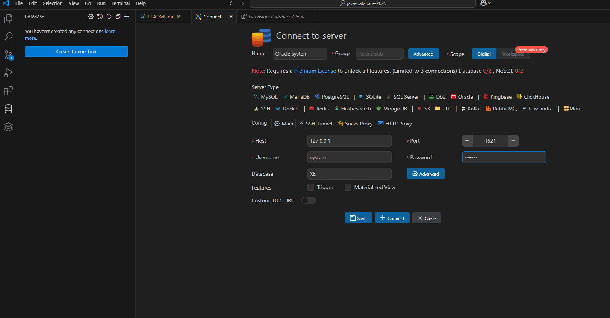

# java-database-2025
java 개발자 과정 Database 리포지토리

## 1일차
- Github Desktop 설치
    - https://desktop.github.com/download/
    - 다운로드 후 기존 Github 계정으로 Signin with Browser
    - Git 명령어 없이 사용 가능능
- Database(DB) 개요
    - 데이터를 저장하는 장소, 서비스를 하는 서버
    - 데이터베이스를 관리하는 프로그램 DBMS
    - 가장 유명한 것이 Oracle
    - 사용자는 SQL로 요청, DB서버는 처리결과를 테이블로 리턴    
- Oracle 설치(Docker)
    1. Powershell 오픈
    2. docker search로 다운하고 싶은 이미지 검색색
    3. pull 내려받기
        ```shell
        PS C:\Users\Admin> docker pull oracleinanutshell/oracle-xe-11g
        
        ```
    4. 다운로드 이미지 확인
        ```shell
        PS C:\Users\Admin> docker image ls
        REPOSITORY                        TAG       IMAGE ID       CREATED        SIZE
        pkmj                              1.1       4e8a935999f3   24 hours ago   1.66GB
        oracleinanutshell/oracle-xe-11g   latest    8b740e77d4b9   6 years ago    2.79GB
        ```
    5. 도커 컨테이너 실행
        ```shell
        PS C:\Users\Admin> docker run --name oracle11g -d -p 1521:1521 --restart=always oracleinanutshell/oracle-xe-11g
        ```
        - 1521 : 오라클 기본 포트
        - 아이디 system / oracle
    6. 도커 실행확인
        - Docker Desktop > Containers 확인
    7. Powershell 오픈
        ```shell
        > docker exec -it oracle11g bash
        [oracle@5b981cdfc286 ~]$ sqlplus / as sysdba
        SQL> 
        ```
    8. DBeaver 접속
        - Connection > Select your DB > Oracle 선택

        

- DBeaver 툴 설치
    - https://dbeaver.io/download/
- DML, DDL, DCL
    - 언어의 특징을 가지고 있음
        - 프로그래밍언어와 차이 - 어떻게(How)
        - SQL - 무엇(What)
    - SQL의 구성요소 3가지
        - DDL(Data Definition Lang) - 데이터베이스 생성, 테이블 생성, 객체 생성, 수정, 삭제
            - CREATE, ALTER DROP ...
        - **DML**(Data Control Lang) - 사용자 권한 부여, 해제, 트랜젝션 시작/종료
            - GRANT, REVOKE, BEGIN TRANS, COMMIT, ROLLBACK
        - DCL(Data Manupulation Lang) - 데이터 조작언어(핵심!), 데이터 삽입,조회,수정,삭제
            - `INSERT`, `SELECT` ,`UPDATE`, `DELETE`
- SELECT 기본
    - 데이터 조회 시 사용하는 기본명령어
        ```sql
        -- 기본 주석(한줄)
        /* 여러줄 주석
           여러줄로 주석 가능*/
        SELECT [ALL|DISTINCT] [*|컬럼명(들)]
            FROM 테이블명(들)
        [WHERE 검색조건(들)]
        [GROUP BY 속성명(들)]
        [HAVING 집계함수조건(들)]
        [ORDER BY 정렬속성(들) ASC|DESC]
        [WITH ROLLUP]
        ```
    - 기본 쿼리 학습 : [SQL](./day01/sql001_select기본.sql)
        1. 기본 SELECT
        2. WHERE 조건절
        3. NULL(!)
        4. ORDER BY 정렬
        5. 집합
- 함수(내장함수)
    - 문자함수: [SQL](./day01/sql02_함수.sql)
    - 숫자함수

## 2일차
- 함수(계속)
    - 문자함수 : [SQL](./day02/sql01_함수.sql)
    - 숫자함수  
    - 날짜함수  
    - 형변환함수 
- 복수행함수: [SQL](./day02/sql02_복수행함수.sql)
    - 집계함수
    - GROUP BY
    - HAVING
    - ROLLUP
    - RANK, DENSE_RANK, ROW_NUMBER

- 데이터베이스 타입형
    - **CHAR(n)**        - 고정형 문자열, 최대 2000바이트
        - CHAR(20)으로 'Hello World'를 저장하면, 'Hello World         '로 저장(공백포함됨됨)
        - 기존코드나 반드시 자리수를 지켜야하는 데이터 필요
    - **VARCHAR2(n)**    - 가변형 문자열, 최대 4000바이트
        - VARCHAR2(20)로 'Hello World'를 저장하면, 'Hello World'로 저장
    - **NUMBER(p,s)**    - 숫자값, p 전체자리수, s 소수점길이, 최대 22byte
    - INTEGER            - 모든 데이터의 기준, 4byte, 정수를 담는 데이터형
    - FLOAT(p)           - 실수형 타입, 최대 22byte
    - **DATE**           - 날짜타입
    - **LONG(n)**        - 가변길이문자열, 최대 2G바이트
    - LONG RAW(n)        - 원시이진 데이터, 최대 2G바이트
    - CLOB               - 대용량 텍스트 데이터타입, 최대 4G
    - BLOB               - 대용량 바이너리 데이터타입, 최대 4G
    - BFILE              - 외부파일에 저장된 데이터, 4G
        
## 3일차
- JOIN : [SQL](./day03/sql02_쿼리실습.sql)
    - ERD(Entity Relationship Diagram) 개체 관계 다이어그램
        - PK(Primary Key) : 기본키, 중복이 안되고 빠진 데이터가 하나도 없다. UNIQUE, NOT NULL
        - FK(Foreign Key) : 외래키, 다른 엔티티(테이블)의 기본키, 두 엔티티의 관계를 연결해주는 값, NULL도 가능하고 중복될 수도 있음
        - Relaitonship    : 부모 엔티티와 자식 엔티티간의 연관, 부모1, 자식 N을 가질 수 있음
    - 카티시안곱
        - 두 개 이상의 테이블의 조건과 관계없이 연결할 수 있는 경우의 수 모두 만든 데이터
        - 조인 이전에 데이터 확인 -  실무에서 카티시안 곱으로 데이터를 사용할 일이 절대 없음
    - 내부조인
        - 다중 테이블에서 보통 PK 와 FK 간의 일치하는 데이터를 한번에 출력하기 위한 방법
        - 관계형 데이터베이스에서 필수로 사용해야 함
        - INNER JOIN 또는 오라클 간결 문법 사용
    - 외부조인
        - PK 와 FK 간 일치하지 않는 데이터도 출력하고자 할 때 사용하는 방법
        - LEFT OUTER JOIN, RIGHT OUTER JOIN 또는 오라클 간결문법 사용용
- DDL: [SQL](./day03/sql04_DDL.sql)
    - CREATE - TABLE, VIEW, PROCEDURE, FUNCTION, 개체를 생성하는 키워드
        - 타입형형
        ``` sql
        CREATE TABLE 테이블명(
            첫번째_컬럼 타입형 제약조건,
            두번째_컬럼 타입형 제약조건,
            ...
            마지막_컬럼 타입형 제약조건
            [,
            기본키, 외래키 등의 옵션이 들어감.
            ]
        )
        ```
    - ALTER - 개체 중 테이블에서 수정이 필요할 대 사용하는 키워드
        ```sql
        ALTER TABLE 테이블명 ADD (컬럼명 타입형 제약조건);
        ALTER TABLE 테이블명 MODIFY (컬럼명 타입형 제약조건);
        ```
    - DROP - 개체 삭제 시 사용하는 키워드
        ```sql
        DROP TABLE 테이블명 PURGE; -- PURGE 는 휴지통
        ```
    - TRUNCATE - 테이블 완전 초기화 키워드드
        ```sql
        TRUNCATE TABLE 테이블명;
        ```
## 4일차
- VS CODE DB 플러그인
    - 확장 > DATABASE 검색 > Database Client(Weijan Chen) > 확장 중 Database 선택
    
- DML
    - INSERT - 테이블에 새로운 데이터를 삽입하는 명령
        - 한 건식 삽입
        ```sql
        INSERT INTO 테이블명[(컬럼리스트)]
        VALUES(값리스트);
        ```
        - 여러건 한번에 삽입
    - UPDATE - 데이터 변경, WHERE 조건을 없이 실행하면 테이블 모든 데이커가 수정됨(주의요망)
        ```sql
        UPDATE 테이블명 SET
            컬럼명 = 변경할 값,
            컬럼명 = 변경할 값 -- 반복
        [WHERE 조건];
        ```
    - DELETE - 데이터 삭제, WHERE 조건 없이 실행하면 테이블의 모든 데이터가 삭제됨(주의요망) 
        ```sql
        DELETE FROM 테이블명
        [WHERE 조건];
        ```
- 트랜젝션
    - 논리적인 처리단위
    - 은행에서 돈을 찾을 때 아주 많은 테이블 접근해서 일을 처리
        - ATM 기계 정보 테이블, 회원 테이블 비밀번호 확인, 계좌정보, 계좌 금액 테이블, 계좌 금액 입출금 내역 테이블
        - 계좌 정보 테이블, 계좌금액입출금내역테이블 금액 빼기, ATM 기계 총지폐 정보 테이블, 영수증 관련 정보 테이블, ATM 기계 정보 테이블, 은행 로그 테이블 ...
        - 적어도 7-8 개 이상의 테이블 접근해서 조회하고 업데이트 수행
        - 제대로 일이 처리안되면 다시 일상복귀
        ```sql
        BEGIN TRANSACTION; -- 트랜젝션 시작
        COMMIT;            -- 트랜젝션 확정
        ROLLBACK;          -- 원상복귀귀
        ```
- 제약조건(CONSTRAINT)
    - 잘못된 데이터가 들어가지 않도록 막는 기법
    - PK       : 기본키, UNIQUE, NOT NULL, 중복되지 않고, 없어도 안됨됨
    - FK       : 외래키, 다른 테이블 PK에 없는 값을 가져다 쓸 수 없음
    - NOT NULL : 값이 빠지면 안됨
    - UNIQUE   : 들어간 데이터가 중복되면 안됨
    - CHECK    : 기준에 부합하지 않는 데이터는 입력되면 안됨
    - DEFAULT - NULL입력시 기본값이 입력되도록 하는 제약조건
    ```sql
    CREATE TABLE 테이블명 (
        컬럼 생성시 제약조건 추가
    );
    ALTER TABLE 테이블명 ADD CONSTRAINT 제약조건  
    ```
- INDEX : INDEX쿼리, 인덱스용테이블생성
    - 책의 찾아보기와 동일한 기능
    - 검색을 매우 빨리 할 수 있도록 해줌
    - B(alanced) Tree를 사용해서 검색횟수를 log(n)건으로 줄임
        - 인덱스 종류
            - 클러스터드(Clustered) 인덱스 (테이블 당 1개)
            - PK에 자동으로 생성되는 인덱스(무지 빠름)
            - PK가 없으면 처음으로 설정되는 UNIQUE 제약조건의 컬럼에 인덱스 생성
            - 보조(Non-Clustered) 인덱스 (여러개)
            - 사용자가 추가하는 인덱스
            - 클러스터드 인덱스보다 조금 느림
        - 유의점
            - PK에 자동 인덱스후 컬럼에 UNIQUE를 걸어도 인덱스가 생성안됨. 수동으로 생성 필요
            - WHERE절에서 검색하는 컬럼은 인덱스를 걸어주는 것이 성능향상에 도움
            - 인덱스는 한 테이블당 4개이상 걸면 성능 저하
            - NULL값, 중복값이 많은 컬럼에 인덱스는 성능 저하
            - INSERT, UPDATE, DELETE가 많이 발생하는 테이블에 인덱스를 걸면 성능 저하
    ```sql
    CREATE INDEX 인덱스명 ON 테이블명(인덱스걸컬럼명)
    ```

## 5일차
- VIEW : [뷰쿼리](./day05/sql01_view.sql)
    - 기존 테이블에서 권한별로 보일 수 있는 컬럼을 지정해서 만드는 개체
    - 기존 테이블 중 개인정보나 중요한 부분이 있으면 제외하고 보일 수 있음
    - 뷰라도 INSERT, UPDATE, DELETE 가능 단, 단일뷰에서만 가능하다

        ```sql
        CREATE VIEW 뷰명
        AS
            SELECT 쿼리;
        [WITH READ ONLY]
        ```
    - 복합뷰는 두개 이상의 테이블을 조인해서 만든 뷰. DML 기능 불가

- 서브쿼리 : [서브쿼리](./day05/sql02_subquery.sql)
    - 메인쿼리를 도와주는 하위쿼리를 뜻함. 소괄호() 내에 포함됨
    - 단일행 서브쿼리, 다중행 서브쿼리마다 사용법 다름
    - SELECT 절 서브쿼리, FROM 절 서브쿼리, WHERE 절 서브쿼리
    - 서브쿼리는 JOIN 으로 거의 변경 가능(안되는 경우도 있음)

- 시퀀스 : [시퀀스](./day05/sql03_sequence.sql)
    - 번호로 지정된 PK 값을 자동으로 삽입할 수 있도록 도와주는 기능
    - 없어도 기능에는 차이가 없지만 효율을 위해 사용
    - ORACLE 에만 존재
        ```sql
        CREATE SEQUENCE 시퀀스명
        INCREMENT BY 1    -- 증가값
        START WITH 1      -- 초기 시작값
        [MAXVALUE 999999] -- 최대 증가값
        [CYCLE]           -- 최대 증가값에 도달하면 처음1로 돌아갈 것인지
        [CACHE]           -- 번호 증가 캐쉬(대용량 삽입시만 관계)

        시퀀스명.NEXTVAL
        시퀀스명.CURRVAL
        ```

- 사용자 계정 권한 : [쿼리](./day05/sql04_사용자계정관리.sql)
    - 사용자 생성 후 권한(룰)을 부여해야 스키마를 사용가능

        ```sql
        -- 권한부여
        GRANT 권한|롤 TO 사용자[WITH ADMIN|GRANT OPTION]
        -- 권한 해제
        REVOKE 권한|롤 FROM 사용자;
        ```

## 6일차
- PL/SQL