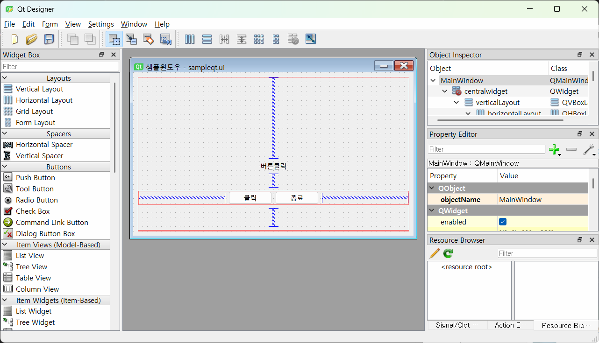
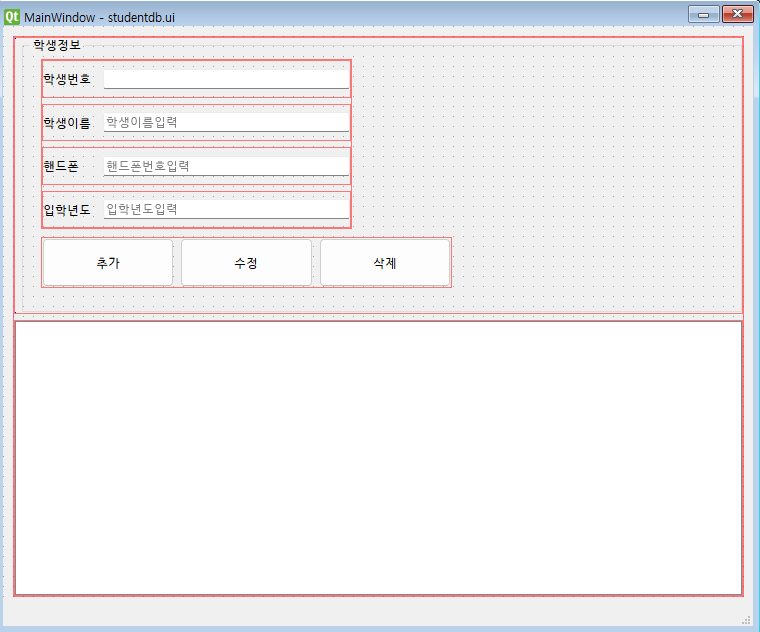

## 토이프로젝트
PYTHON GUI - ORACLE 연동 프로그램

### GUI 프레임워크
- GUI 프레임워크 종류
    1. TKINTER 
        - 파이썬에 내장된 GUI 라이브러리, 중소형 프로그램 사용, 간단하게 사용가능, 예쁘지가 않아 단점임
    2. PyQt /PySide 
        - C/C++에서 사용하는 GUI 프레임워크 Qt를 Pyhton에 사용하게 만든 라이브러리, 현재 6버전 출시, 유료
        - PyQt 의 상용라이선스 문제로 PySide 등장. PyQt 에서 PySide 로 변경하는데 번거로움이 존재
        - TKINTER 보다 난도가 있지만 아주 예쁨, QtDesigner 툴로 포토샵처럼 GUI 를 디자인 가능
        - Python GUI 중에서 가장 많이 사용중
    3. Kivy
        - OpenGL(게임엔진용 3D 그래픽엔진) 으로 구현되는 GUI 프레임워크
        - 안드로이드, IOS 등 모바일용으로도 개발 가능
        - 최신에 나온 기술이라 아직 불안정함
    4. wxPython
        - Kivy 처럼 멀티플랫폼 GUI 프레임워크
        - 무지 어려움

### PyQt5 GUI 사용
    - PyQt5 설치
        -  콘솔 `> pip install PyQt5`
    - QtDesigner 설치
        - https://build-system.fman.io/qt-designer-download 다운로드 후 설치

        


#### PyQt5 개발
1. PyQt 모듈 사용 윈앱 만들기
2. 윈도우 기본설정
3. PyQt 위젯 사용법(레이블, 버튼, ...)
4. 시그널(이벤트) 처리방법
5. QtDesigner로 화면디자인, PyQt와 연동
    

#### Oracle 연동 GUI 개발 시작
- 오라틀 Python 연동 DB(스키마) 생성
    ```sql
    -- madang 스키마, 사용자 생성
    CREATE USER madang IDENTIFIED BY madang;

    -- 권한 설정
    GRANT CONNECT, resource TO madang;

    -- madang 으로 사용 스키마 변경

    -- Students 테이블 생성
    CREATE TABLE Students(
        std_id 	    NUMBER 		  PRIMARY KEY,
        std_name    varchar2(100) NOT NULL,
        stg_mobile  varchar2(15)  NULL,
        std_regyear number(4,0)   NOT null
    );

    -- Students 용 시퀀스 생성
    CREATE SEQUENCE seq_student
        INCREMENT BY 1		-- 숫자를 1씩 증가
        START WITH 1;		-- 1부터 숫자가 증가됨
        
    COMMIT;
    ```
- Student 테이블 생성, 더미데이터 추가
    ```sql
    -- madang 로그인

    -- 조회
    SELECT * FROM students;

    -- 더미데이터 삽입
    INSERT INTO students(STD_ID, STD_NAME, stg_mobile, STD_REGYEAR)
    VALUES (seq_student.nextval, '홍길동', '010-4562-7895', 1997);

    INSERT INTO students(STD_ID, STD_NAME, stg_mobile, STD_REGYEAR)
    VALUES (seq_student.nextval, '홍길순', '010-1235-7895', 2000);

    COMMIT;
    ```
- Python 오라클 연동 테스트
    - 오라클 모듈
        - oracledb - Oracle 최신버전에 매칭
        - **cx_Oracle** - 구버전까지 잘 됨
        - 콘솔에서 `> pip install cx_Oracle `
        - [Microsoft C++ Build Tools] (https://visualstudio.microsoft.com/ko/visual-cpp-build-tools/) 필요
        - Visual Studio Installer 실행
            - [x] MSVX v1XX - VS20XX C++ x64/x86 빌드도구
            - [x] C++ CMAKE TOOLS FOR Window
            - [x] Windows 10 SDK(10.0.xxxxx)
        - 설치
    - 콘솔에서 `>pip install cx_Oracle`
    - 콘솔 오라클 연동: [python](./ora01_test.py)
        - DPI-1047 오류발생
        - 64-bit Oracle Client library 가 설치되지 않아서 생기는 문제
        - https://www.oracle.com/kr/database/technologies/instant-client/winx64-64-downloads.html
        - 위 사이트에서 버전에 맞는 Oracle Client 를 다운로드
        - 11g 다운로드
        - 압축해제(C:\Dev\Tool\instantclient_11_2)
        - 시스템정보에 Path 등록
        - 재부팅
    - 콘솔 테스트 결과 <br>
        

- QtDesigner 로 화면 구성
    

- PyQt 로 Oracle 연동 CRUD 구현
    - 조회 SELECT 구현
    - 삽입 INSERT 구현
    - 수정 UPDATE, 삭제 DELETE 구현
    - 입력값 검증(Validation Check) -> 적절한 곳에 쓰면 좋음
    - DML 이 종료된 수 다시 데이터 로드 로직 추가
    - 데이터 삽입 후 Line Edit에 기존 입력값이 남아있음 -> 제거

- 개발 도중 문제
    - [ ] DB에 저장된 데이터를 테이블 위젯에서 더블클릭한 뒤 수정않고 추가를 눌러도 새로운 데이터로 삽입되는 문제
    - [ ] 수정모드에서 추가를 한 뒤 학생번호가 Line Edit에 그대로 존재

### 데이터베이스 모델링
-  서점 데이터 모델링